# Whip

<p align="center">
  
</p>

<p align="center">
  <strong>Run your Herdr workflow from your phone or tablet.</strong><br>
  Monitor and chat with remote agents, work in their terminals, and move files over SSH from a native Android or iOS interface.
</p>

<p align="center">
  <a href="https://github.com/kosumic/whip/actions/workflows/ci.yml"></a>
  <a href="https://github.com/kosumic/whip/actions/workflows/codeql.yml"></a>
  <a href="https://expo.dev"></a>
  <a href="#ios"></a>
</p>

<p align="center">
  <a href="https://play.google.com/store/apps/details?id=io.github.kaminarios.whip"></a><br>
  Early Access: <a href="https://groups.google.com/g/whip-community">join the Whip Community</a>, wait a moment for access to propagate, then use the Google Play link above.
</p>

<p align="center">
  <a href="https://youtu.be/dx5s3LmMErE"></a><br>
  <a href="https://youtu.be/dx5s3LmMErE"><strong>Watch the Whip launch video</strong></a>
</p>

Whip gives [Herdr](https://github.com/herdrdev/herdr) a touch-friendly mobile interface without exposing Herdr itself to the network or requiring changes on the host. It connects to your machine over SSH—directly or through saved jump hosts, ideally over Tailscale—and rebuilds the management experience as native screens. You can watch the whole herd, prompt an agent through a native chat composer, browse remote files, or attach to a full terminal when you need it.

The app separates connection management from daily supervision: **Hosts** manages saved SSH endpoints and exposes their live Herdr state, **Herd** merges connected agents into a scoped attention queue, **Terminal** keeps open pane sessions and their full-screen Chat View within reach, and **More** holds security, notification, appearance, and terminal preferences.

Whip is not developed, maintained, or endorsed by the Herdr project or its authors.

## Contents

- [Preview](#preview)
- [What you can do](#what-you-can-do)
  - [Supervise Herdr](#supervise-herdr)
  - [Use Chat View](#use-chat-view)
  - [Work in terminals](#work-in-terminals)
  - [Move files and attachments](#move-files-and-attachments)
  - [Connect securely](#connect-securely)
  - [Make it yours](#make-it-yours)
- [Install Whip](#install-whip)
  - [Android](#android)
  - [iOS](#ios)
- [Connect your first host](#connect-your-first-host)
  - [Pair with a QR code](#pair-with-a-qr-code)
  - [Enter a host manually](#enter-a-host-manually)
- [How it works](#how-it-works)
- [Performance](#performance)
- [Architecture](#architecture)
  - [React Native Frontend](#react-native-frontend)
  - [Whip Rust Core](#whip-rust-core)
- [Development](#development)
  - [EAS builds](#eas-builds)
  - [Google Play publishing](#google-play-publishing)
  - [Validation](#validation)
- [Community](#community)
- [Credits](#credits)
- [License](#license)

## Preview

<table>
  <tr>
    <td align="center"></td>
    <td align="center"></td>
  </tr>
  <tr>
    <td align="center"><strong>Manage every host</strong><br>See live connection state, latency, and saved authentication at a glance.</td>
    <td align="center"><strong>Watch the whole herd</strong><br>Merge open hosts into one attention queue, then scope it to a host or space.</td>
  </tr>
  <tr>
    <td align="center"></td>
    <td align="center"></td>
  </tr>
  <tr>
    <td align="center"><strong>Work from anywhere</strong><br>Keep remote terminal tabs warm, use mobile controls, and open discovered web links or remote files in one tap.</td>
    <td align="center"><strong>Read the conversation</strong><br>Follow native Codex and OpenCode transcripts with rich text, links, code, and tool activity.</td>
  </tr>
  <tr>
    <td align="center"></td>
    <td align="center"></td>
  </tr>
  <tr>
    <td align="center"><strong>Chat naturally</strong><br>Prompt a remote agent from the native multiline composer with Android keyboard, suggestion, and voice-input support.</td>
    <td align="center"><strong>Bring the filesystem with you</strong><br>Browse, sort, upload, download, edit, delete, or preview the terminal's remote files over SFTP.</td>
  </tr>
  <tr>
    <td align="center"></td>
    <td align="center"></td>
  </tr>
  <tr>
    <td align="center"><strong>Reach private hosts safely</strong><br>Build nested jump-host routes and opt into SSH agent forwarding without placing the private key on the server.</td>
    <td align="center"><strong>Make Whip yours</strong><br>Place translucent app surfaces over a custom background, then tune alerts, speech, security, navigation, and terminal behavior.</td>
  </tr>
</table>

Screenshots were captured from the current ARM64 release build on a Pixel 9 Pro.

## What you can do

### Supervise Herdr

- Monitor every open host in one native attention queue, with per-host and per-space scopes.
- See working, blocked, done, idle, and unknown agents, including their host and space context.
- Keep connected hosts first and order them by the same agent-status priority as the Herd queue; see each host's agent count, Herdr protocol, measured latency, and jump-host route.
- Move through Herdr hosts, spaces, tabs, panes, and agents without living in a terminal.
- Create, focus, rename, split, zoom, inspect, and close space resources, including swipe-to-close Herd tabs.
- Launch agents and chat through a native multiline composer with mobile keyboard, dictation, selection, and suggestion support.
- Run editable commands from the Herd screen and reuse the same persistent input history available in the terminal.

### Use Chat View

Chat View is currently available for active OpenCode and Codex panes. Tap the book icon in the bottom terminal controls to replace that terminal with a full-screen, native transcript; tap the same control again to return to the same warm terminal. Each open terminal remembers its own Terminal or Chat View when you switch between panes.

- Read a normalized, OpenCode-style conversation instead of terminal scrollback, including user prompts, Markdown responses, plans, reasoning, live **Thinking** state, token and timing metadata, attachments, and images.
- Inspect expandable tool activity without duplicate shell rows. Related read, list, and search operations are grouped; shell commands, output, diagnostics, and changed-file diffs remain available on demand.
- Render GitHub-flavored Markdown, monospaced inline and fenced code, clickable remote file references, and inline or display math on Android and iOS.
- Load the existing history once, then follow new Codex rollout records or official OpenCode durable events incrementally. Whip reads the locally installed agents through the existing SSH connection; it does not require a hosted chat relay.
- Keep using the terminal control strip in Chat View. Its Compose control opens the same native composer, draft, attachments, and per-tab send queue used by Terminal; closing the composer leaves Chat View open.
- On Android, enable **Voice announcements** in Settings to announce agent status changes and read new replies from the focused chat aloud, including with Whip in the background or the screen locked. Voice announcements are off by default. Chat reading skips loaded history, reasoning, tools, and code blocks, and follows only the selected chat. Switching to Terminal or leaving the session stops playback; the ongoing notification also has a **Stop listening** action. Calls and headphone disconnection stop listening.
- Follow Whip's existing system, GitHub Light, and Tokyo Night themes. When the app background and experimental glass mode are enabled, Chat View applies the same translucent material while keeping the transcript legible.

### Work in terminals

- Attach to any selected pane through an immersive, xterm-compatible terminal.
- Open a plain SSH login shell when Herdr is stopped, unavailable, or not installed yet.
- Keep multiple terminal surfaces warm while switching or swiping between tabs, with a buffered composer, ANSI colors, modifier keys, touch scrolling, Page Up/Down, selection, live resizing, and configurable appearance.
- Keep reading an open Herdr pane when its live connection drops: Whip switches the terminal to a local, read-only virtual Herdr backend backed by a bounded cache of recent ANSI output. Arrow keys, Page Up/Down, Home, End, and touch scrolling remain available while terminal writes stay disabled.
- Queue native-composer submissions in a per-terminal outbox while offline, review or move them back into the composer, and send them in order when that terminal reconnects.
- Reuse persistent input history, copy previous commands with a long press, and configure fullscreen behavior, volume-key and double-tap actions, and the number of cached xterm surfaces.
- Scan terminal scrollback for web links and open local or LAN services in the in-app browser through an on-demand SSH tunnel.
- Recover open control connections after network changes and app resume without restarting healthy sessions.

### Move files and attachments

- Browse the active terminal's current directory over SFTP, remember a location per terminal, and sort by name, modification time, or size.
- Upload, download, edit, or swipe-delete remote files; preview code, text, Markdown with remote links and images, raster images, SVG, standalone Mermaid diagrams, streamed PDF, audio, and video, and sandboxed HTML.
- Upload a photo, file, camera capture, or clipboard image to the host and paste its remote path into the terminal composer.

### Connect securely

- Import, inspect, copy, remove, or generate SSH keys, and reuse them from a biometric-protected global keychain.
- Authorize a generated, global-keychain, or clipboard public key by scanning a one-time QR code from [`whipair`](whipair/README.md), using the host's existing SSH port without a relay.
- Route connections through nested, OpenSSH-compatible jump hosts and optionally forward a profile's key as an SSH agent without copying the private key to the server.
- Verify every direct and jump-host connection against a global known-hosts list, prompting for unknown fingerprints and rejecting changed host keys.
- Store each host's password or private-key credential in Android Keystore or iOS Keychain, with encrypted, device-authenticated Block Store recovery on supported Android devices.
- Keep several named Herdr hosts open and switch between their live sessions.

### Make it yours

- Receive local notifications, vibration, and optional speech when an agent becomes blocked or finishes.
- Set the duration of background agent alerts, dismiss active alerts by returning to Whip, and customize terminal gestures, controls, history, fonts, and cached sessions.
- Use the app in English, Japanese, Spanish, Simplified Chinese, or Traditional Chinese, with system, light, GitHub Light, dark, and Tokyo Night appearance options.
- Choose an app background image and optionally layer experimental translucent glass bars, rows, controls, and navigation over it.

## Install Whip

### Android

The recommended installation is through the [Google Play Early Access program](https://play.google.com/store/apps/details?id=io.github.kaminarios.whip). Before using the Google Play link, join the [Whip Community](https://groups.google.com/g/whip-community) and wait a moment for membership to propagate.

Signed ARM64 APKs are also published as normal latest releases on [GitHub Releases](https://github.com/kosumic/whip/releases). They use the project's existing release key and include a SHA-256 checksum alongside the APK.

1. Read the [security policy](SECURITY.md) and [privacy notes](PRIVACY.md).
2. Install through Google Play, or download `whip-arm64.apk` and its checksum from the latest GitHub release.
3. Allow installation from the app that downloaded the APK, then open Whip.
4. Make the host reachable over SSH, preferably through a Tailnet you trust. Whip can open a plain SSH shell even when Herdr is not installed, and a private destination can be reached through a saved jump host.

Whip supports Android 7.0 and newer (`minSdk 24`). The current direct APK distribution targets 64-bit ARM Android devices. Keep using the same distribution source when updating: Google Play may re-sign store builds through Play App Signing, so Android can require an uninstall when switching between Play and GitHub packages.

### iOS

Whip supports iOS 16.4 and newer on ARM64 devices. CI compiles a thin unsigned device app and uploads `whip-ios-unsigned-compile-only.app.zip` as a short-lived GitHub Actions artifact. It is compile validation only: it is not attached to tagged GitHub releases, distributed through the App Store or TestFlight, signed, or directly installable. For a locally signed device build, follow the development instructions below.

## Connect your first host

You need an SSH server on a laptop or server reachable from the mobile device. If Herdr is already installed, confirm the same connection outside Whip first:

```bash
ssh user@laptop.tailnet.ts.net 'herdr status server --json'
```

### Pair with a QR code

In Whip, open **Add host** and choose **Scan pairing QR**. On the Mac or Linux
host, run the pairing helper with any one of these package managers:

```bash
# Nix (GitHub flake)
nix run github:kosumic/whip#whipair

# uv
uvx whipair

# npm
npx whipair

# Cargo
cargo install --locked whipair
whipair
```

Select the reachable network and confirm the SSH port, then open **Add host**
in Whip. Choose a newly generated key, a key from the global keychain, or a
public key from the clipboard; scan the displayed QR and approve the key in
the host terminal. Pairing uses the existing SSH port and automatically stores
the verified SSH host key. A clipboard public key has no private credential in
Whip, so it authorizes and saves the host without making it immediately
connectable from that device.

The uv, npm, and Cargo versions require `ssh-keyscan` from an OpenSSH client
package. The Nix app includes it. See the
[`whipair` documentation](whipair/README.md) for the protocol, security
boundaries, local-checkout Nix command, and nonstandard-port options.

### Enter a host manually

To enter the host without QR pairing:

1. Tap **Add your first host**.
2. Enter the Tailscale DNS name or `100.x.y.z` address, SSH user, and password or private key. You can import, paste, or generate an Ed25519 key in the app.
3. Leave **Command** as `herdr`, or enter its absolute path if it is not in the non-interactive SSH `PATH`.
4. Choose the Herdr session name and connect.
5. On first connection, compare the displayed SSH fingerprint with the host through an independent trusted channel, then choose **Trust host**. Whip refuses a changed key on later connections.

Whip saves the credential after you save or connect to a host, enabling one-tap reconnects. Host profiles can also reuse a key from **More → Global SSH keychain**.

For a destination that is not directly reachable, save and connect to the outer host first. Edit the destination, select that profile under **Jump host**, and connect. Jump hosts can themselves use another saved jump host; each hop keeps its own authentication, host-key verification, and optional agent-forwarding setting. Manage trusted fingerprints under **More → Known SSH hosts**.

If Herdr is not installed yet, Whip still keeps the SSH connection open. From the offline host screen, choose **Open SSH shell** and install or troubleshoot Herdr yourself; Whip never installs software on the host.

Whip accepts Herdr releases that report protocols 17 through 22 and rejects other protocol versions to avoid sending incompatible commands. The **About Whip** screen shows both sides of the active connection.

## How it works

Whip connects from the mobile device to the configured SSH host, either directly or through its saved jump-host chain. There is no Whip-operated relay service, and Herdr remains bound to the host as usual. Strict known-host verification applies to every hop.

Native screens read snapshots and live events from Herdr's local API sockets through the authenticated SSH connection. Actions use the same structured API, while each open pane terminal uses Herdr's client-protocol socket for live input, resize, scroll, and render frames. The remote file manager and terminal attachments use SFTP on that connection. Links found in terminal scrollback open directly when they are public; loopback and private-network addresses are forwarded through SSH first.

Chat View does not derive conversations from terminal pixels or scrollback. For OpenCode, the Rust host runtime takes an initial snapshot with the official `opencode export` command and then requests only newer durable session events through the official `opencode db` query interface. For Codex, it resolves the rollout matching Herdr's exact native session ID, reads the initial JSONL snapshot, and follows appended records. Both sources are adapted into one typed Rust transcript model on the device, so the native renderer and shared composer behave consistently without adding a Whip service to the host.

For an open, visible Herdr terminal, Whip periodically caches a bounded recent ANSI transcript in memory. If the terminal transport is connecting, disconnected, or in error, a local virtual backend owns that transcript and its per-terminal logical scroll position while the renderer presents it read-only; it does not run Herdr or an agent on the mobile device. Messages submitted through the native composer wait in an in-memory, per-terminal outbox and are retried in order after the live connection returns. The transcript, scroll position, and outbox are session fallbacks, not durable offline storage, and do not survive an app restart.

An unknown server key requires explicit fingerprint approval before Whip stores it in the device-wide known-hosts list. A changed key is rejected until you investigate it and deliberately forget the old entry. See [SECURITY.md](SECURITY.md) for the current security posture and [PRIVACY.md](PRIVACY.md) for the data flow and on-device storage details.

## Performance

Whip's terminal latency is instrumented with correlated Android Perfetto slices
from native input handling through confirmed WebView presentation. August 27,
2026 release-build captures on a Pixel 9 Pro connected to the `thinker` host
produced the following baseline. The end-to-end capture contains 20 correlated
keystrokes; a subsequent passive capture covers 277 frames after terminal
encoding moved off the JavaScript thread. Network conditions, remote output, and
display scheduling vary, so treat these as representative observations rather
than universal benchmarks.

Release builds also retain a bounded history of the latest 500 SSH latency probes
that take at least 200 ms or fail. Each slow record separates the native SSH
ping/pong time from total JavaScript dispatch-to-resolution time. The history is
available in **More → Diagnostics**, persists across app restarts, and is never
uploaded automatically.

| Stage | Average | p50 / p95 | Observed range | Samples |
| --- | ---: | ---: | ---: | ---: |
| App wait before entering native code | 0.03 ms | 0.02 / 0.08 ms | 0.01–0.09 ms | 20 |
| Native/Rust validation, framing, and queueing | 0.19 ms | 0.11 / 0.42 ms | 0.03–1.12 ms | 20 |
| Complete React Native input-to-native dispatch | 0.39 ms | 0.27 / 0.75 ms | 0.12–1.38 ms | 20 |
| Queue accepted to first returned terminal frame | 84.76 ms | 61.68 / 212.60 ms | 0.15–343.80 ms | 20 |
| Returned frame to confirmed visible | 35.45 ms | 31.78 / 58.52 ms | 20.16–106.06 ms | 20 |
| Complete input to confirmed visible | 120.60 ms | 92.66 / 243.26 ms | 39.60–375.17 ms | 20 |

[](docs/android-terminal-input-latency.svg)

The first three rows overlap and must not be added together. The final three
rows form the measured average critical path: 0.39 ms of local dispatch, 84.76
ms from native queue acceptance to the first returned frame, and 35.45 ms from
that frame to the conservative visibility marker. The queue-to-response span
includes SSH/network time, remote PTY processing, and inbound native delivery;
because the protocol cannot identify causality, unrelated terminal output can
also satisfy the first-frame marker.

Warm renderers and retained terminal bridges avoid cold attach work. In the
newer passive post-change capture, 277 frames took 39.29 ms on average from Rust
frame delivery to the visibility marker (p50 38.95 ms, p95 55.43 ms, observed
range 19.09–73.58 ms). See [Android terminal latency
tracing](docs/android-performance-tracing.md) for the slice definitions,
capture command, SQL analysis, and interpretation.

## Architecture

Whip is split between the React Native presentation layer and one Whip-owned
Rust/native core. React Native owns presentation and platform integration;
Rust `AppCore` owns application/session state across hosts above the
authoritative per-host runtimes. The diagrams below show those ownership
boundaries together with the terminal and remote-host paths.

### React Native Frontend

[](docs/react-native-frontend-architecture.svg)

[Edit the React Native frontend diagram](docs/react-native-frontend-architecture.mmd).

### Whip Rust Core

[](docs/whip-rust-core-architecture.svg)

[Edit the Whip Rust Core diagram](docs/whip-rust-core-architecture.mmd).

`react-native-whip-ssh` exposes one New Architecture module and links one Rust
static library with one Tokio runtime. Immediately below that boundary, Rust
`AppCore` owns application sessions, active-session and client workspace/tab/pane
selection, selection repair, logical terminal rails, multi-host Herd aggregation,
and revisioned typed application views. It references one `HostRuntime` per
application session without taking ownership of Herdr server truth. Each
`HostRuntime` owns its authoritative `HostState`, reconnect/restoration lifecycle,
monitoring and diagnostics, terminal transports, agent sessions, and remote
operations. Its stable `HerdrConnection` is the sole owner/coordinator of the
currently installed authenticated `SshSession` and generation; Rust services
request guarded logical streams instead of retaining transport handles.

React Native mechanically projects those native views and sends typed semantic
operations through thin AppCore adapters and the `HerdrClient` runtime facade.
It still owns navigation, sheets/forms, platform credentials, pickers/share and
previews, presentation preferences, opaque SQLite transcript-cache storage, and
the mounted WebView/xterm rendering lifecycle. QR-pinned WP4 pairing and
key-management/native-diagnostic utilities share the same native module.

After editing either Mermaid source, regenerate the committed SVGs from `nix develop` with `npm run generate:readme-diagrams`.

## Development

Whip uses Expo SDK 57 with custom Android and iOS native builds. It cannot run in Expo Go because the shared Rust SSH transport, platform credential stores, and terminal renderer use native modules.

On NixOS, the included development shell provides Node.js 22, JDK 17, and the required Android SDK and NDK versions. Start Metro in one terminal, in offline mode with Whip's explicit development-client scheme and a LAN bind so the USB-reversed IPv4 endpoint works:

```bash
nix develop
npm ci
npm start -- --scheme whip --host lan --offline
```

Then connect an ARM64 device and build only its architecture from a second development shell:

```bash
nix develop
adb reverse tcp:8081 tcp:8081
ORG_GRADLE_PROJECT_reactNativeArchitectures=arm64-v8a npm run android -- --no-bundler
```

If the development client does not open the project automatically, launch the USB-forwarded localhost URL with Whip's scheme:

```bash
adb shell am start -W \
  -a android.intent.action.VIEW \
  -d 'whip://expo-development-client/?url=http%3A%2F%2Flocalhost%3A8081'
```

On other systems, install Node.js 22, JDK 17, Android SDK Platform 36, Build Tools 36.0.0, NDK 27.1.12297006, and CMake 3.22.1, then use the same `npm` and `adb` commands with `ANDROID_HOME` set.

See [DEBUG.md](DEBUG.md) for the complete emulator and physical-device loop.

On macOS, the Nix shell supplies Node.js, CocoaPods, and the pinned Rust target while Xcode supplies the Apple build toolchain:

```bash
nix develop
npm ci
cd ios
bundle exec pod install
```

Open `ios/HerdR.xcworkspace` in Xcode for a signed device build. `scripts/install-ios-device.sh` provides a guided local build and in-place install, while CI invokes `scripts/build-ios-app.sh --unsigned` for reproducible thin-ARM64 compile validation.

### EAS builds

After authenticating and initializing the Expo project:

```bash
npx eas-cli build --profile development --platform android
npx eas-cli build --profile preview --platform android
npx eas-cli build --profile ios-simulator --platform ios
```

The `development` profile creates an Expo development client, `preview` creates an installable Android APK, and `ios-simulator` creates an unsigned iOS simulator build.

### Google Play publishing

The manually triggered `Publish Android app bundle` GitHub Actions workflow builds a signed ARM64 `.aab` and uploads it through EAS Submit. Its default `internal-draft` profile leaves an internal-track release in Google Play Console for review; `production-draft` creates a production draft, `internal` publishes to internal testers, and `closed` creates a completed alpha/closed-testing release.

Before the first run, create a Google Play service account with Play Console access and an Expo access token, then configure these GitHub repository or `google-play` environment secrets:

- `ANDROID_UPLOAD_KEYSTORE_BASE64`: the base64-encoded Play upload keystore
- `ANDROID_UPLOAD_KEYSTORE_PASSWORD`
- `ANDROID_UPLOAD_KEY_ALIAS`
- `ANDROID_UPLOAD_KEY_PASSWORD`
- `GOOGLE_PLAY_SERVICE_ACCOUNT_JSON`: the complete service-account JSON document
- `EXPO_TOKEN`

For example:

```bash
base64 -w 0 /path/to/upload-keystore.jks | gh secret set ANDROID_UPLOAD_KEYSTORE_BASE64
gh secret set ANDROID_UPLOAD_KEYSTORE_PASSWORD
gh secret set ANDROID_UPLOAD_KEY_ALIAS
gh secret set ANDROID_UPLOAD_KEY_PASSWORD
gh secret set GOOGLE_PLAY_SERVICE_ACCOUNT_JSON < /path/to/google-play-service-account.json
gh secret set EXPO_TOKEN
```

Increment `versionCode` in `android/app/build.gradle` for every Play upload, commit the release, and start a draft upload with:

```bash
gh workflow run publish-play.yml -f submit_profile=production-draft
```

### Validation

Run the primary JavaScript and Rust validation sets before opening a pull request:

```bash
nix develop -c npm run doctor
nix develop -c npx tsc --noEmit
nix develop -c npm run worker:check
nix develop -c npm run lint
nix develop -c npm test -- --runInBand
nix develop -c npm run bundle:ios
nix develop -c npm run check:license-notices

nix develop -c cargo fmt --manifest-path packages/react-native-whip-ssh/rust/Cargo.toml --check
nix develop -c cargo clippy --manifest-path packages/react-native-whip-ssh/rust/Cargo.toml --locked --all-targets -- -D warnings
nix develop -c cargo test --manifest-path packages/react-native-whip-ssh/rust/Cargo.toml --locked
```

CI additionally runs the live OpenSSH integration test, RustSec audit, ARM64 Android lint/build, unsigned thin-ARM64 iOS compile, and XCFramework validation. To reproduce the native compile checks locally, use `nix develop -c android/gradlew -p android app:lintRelease app:assembleDebug -PreactNativeArchitectures=arm64-v8a --no-daemon` on Android or `nix develop -c scripts/build-ios-app.sh --unsigned` on macOS after installing pods.

The native core is maintained in
[`packages/react-native-whip-ssh`](packages/react-native-whip-ssh). Both mobile
platforms link the same Rust/Russh library and expose the same WhipSsh
TurboModule; there is no legacy or second SSH native fallback.

## Community

- Read [CONTRIBUTING.md](CONTRIBUTING.md) before opening a pull request.
- Ask usage and design questions in [GitHub Discussions](https://github.com/kosumic/whip/discussions).
- Use the issue forms for reproducible bugs and scoped feature requests.
- Follow the [Code of Conduct](CODE_OF_CONDUCT.md).
- Review the [roadmap](ROADMAP.md) for current priorities.

Feedback is especially useful around Android and iOS device compatibility, real-world Herdr workflows, terminal ergonomics, safe SSH trust UX, and the path from the current unsigned iOS build to a signed beta.

## Credits

Whip learned from [Voltius](https://github.com/VoltiusApp/voltius) during the early stages of development. We are grateful to the Voltius maintainers and contributors for sharing their work.

Whip's Chat View is inspired by and adapted from the conversation design of [OpenCode Web](https://github.com/anomalyco/opencode). OpenCode is available under the MIT License; its copyright notice and complete license text are included in [Third-Party Notices](THIRD_PARTY_NOTICES.md#opencode-web).

## License

Whip is licensed under the [GNU Affero General Public License v3.0 or later](LICENSE).

Third-party work remains subject to its original terms; see [Third-Party Notices](THIRD_PARTY_NOTICES.md).
